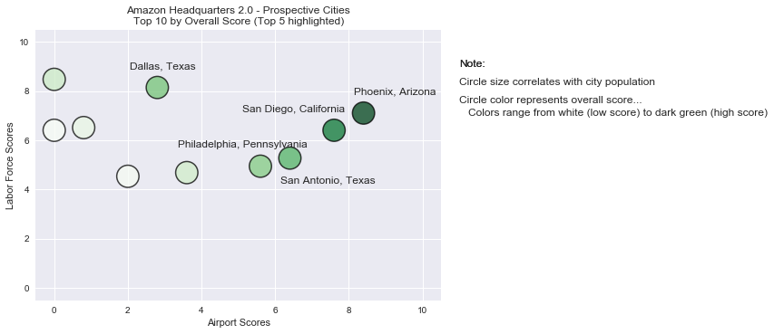

# Team - Dissolvable Data


## Our Project is to dissolve all the data to find a list of recommended suitable cities to have a headquarter/branch of any company based on its specific parameters.

### The Input Parameters are 

    1. Minimum Population in that city  
    2. Primary Labor Force Required - Only one from 22 Occupations  
    3. Secondry Labor Force Requried - Only one from 21 Occupations  
    4. Optional Labor Force Require - Zero or more from 20 Occupations  
    5. Weightage for Population - From Zero to 10   
    6. Weightage for Labor Force - From Zero to 10   
    7. Weightage for Proximity to Airport - from Zero to 10 - If all weightages are zero, it is automatically  
       takes as 1 

#### Dependencies Libraries 


```python
# Dependencies Libraries 
import pandas as pd
import numpy as np
import matplotlib.pyplot as plt
import seaborn as sns
import requests as req
import json
import ipywidgets as widgets
from IPython.display import display, HTML
from ipywidgets import interactive, Layout, Textarea, Dropdown, Label
HTML('<style> .widget-hbox .widget-label { max-width:350ex; text-align:left} </style>')
```


<style> .widget-hbox .widget-label { max-width:350ex; text-align:left} </style>


#### Creating the list for Population and Labor Force Catagory


```python
# Population Catagory Options in a list 
population_catagory = ['>=100000','>=250000','>=500000','>=1000000']

labor_force_catagory = ['Management','Business and Financial Operations','Computer and Mathematical',
                        'Architecture and Engineering','Life, Physical, and Social Science',
                        'Community and Social Service','Legal','Education, Training, and Library',
                        'Arts, Design, Entertainment, Sports, and Media','Healthcare Practitioners and Technical',
                        'Healthcare Support','Protective Service','Food Preparation and Serving Related',
                        'Building and Grounds Cleaning and Maintenance','Personal Care and Service',
                        'Sales and Related','Office and Administrative Support','Farming, Fishing, and Forestry',
                        'Construction and Extraction','Installation, Maintenance, and Repair','Production',
                        'Transportation and Material Moving']
```

#### Definition for the layout for the Input Selection 


```python
form_item_layout = Layout(
    display='flex',
    #flex_flow='row',
    justify_content='space-between',
    flex_flow='column',
    border='solid 2px',
    align_items='stretch',
    width='70%'
)
```

#### Loading the Census Data to a DataFrame


```python
census = pd.read_csv('Census.csv', encoding="ISO-8859-1")
census.head()
```


<div>
<style>
    .dataframe thead tr:only-child th {
        text-align: right;
    }

    .dataframe thead th {
        text-align: left;
    }

    .dataframe tbody tr th {
        vertical-align: top;
    }
</style>
<table border="1" class="dataframe">
  <thead>
    <tr style="text-align: right;">
      <th></th>
      <th>City</th>
      <th>Population</th>
      <th>County</th>
      <th>State</th>
      <th>FullState</th>
      <th>MSA</th>
      <th>Population Score</th>
      <th>Closest Airport</th>
      <th>Proximity to Airport</th>
      <th>Airport Score</th>
    </tr>
  </thead>
  <tbody>
    <tr>
      <th>0</th>
      <td>New York</td>
      <td>8537673</td>
      <td>Bronx County</td>
      <td>NY</td>
      <td>New York</td>
      <td>New York-Jersey City-White Plains, NY-NJ Metro...</td>
      <td>10.0</td>
      <td>Newark Liberty International Airport</td>
      <td>28 min</td>
      <td>0.8</td>
    </tr>
    <tr>
      <th>1</th>
      <td>Los Angeles</td>
      <td>3976322</td>
      <td>Los Angeles County</td>
      <td>CA</td>
      <td>California</td>
      <td>Los Angeles-Long Beach-Glendale, CA Metropolit...</td>
      <td>10.0</td>
      <td>Los Angeles International Airport</td>
      <td>25 min</td>
      <td>2.0</td>
    </tr>
    <tr>
      <th>2</th>
      <td>Chicago</td>
      <td>2704958</td>
      <td>Cook County</td>
      <td>IL</td>
      <td>Illinois</td>
      <td>Chicago-Naperville-Arlington Heights, IL Metro...</td>
      <td>10.0</td>
      <td>O'Hare International Airport</td>
      <td>31 min</td>
      <td>0.0</td>
    </tr>
    <tr>
      <th>3</th>
      <td>Houston</td>
      <td>2303482</td>
      <td>Harris County</td>
      <td>TX</td>
      <td>Texas</td>
      <td>Houston-The Woodlands-Sugar Land, TX</td>
      <td>10.0</td>
      <td>George Bush Intercontinental Airport</td>
      <td>21 min</td>
      <td>3.6</td>
    </tr>
    <tr>
      <th>4</th>
      <td>Phoenix</td>
      <td>1615017</td>
      <td>Maricopa County</td>
      <td>AZ</td>
      <td>Arizona</td>
      <td>Phoenix-Mesa-Scottsdale, AZ</td>
      <td>10.0</td>
      <td>Phoenix Sky Harbor International Airport</td>
      <td>9 min</td>
      <td>8.4</td>
    </tr>
  </tbody>
</table>
</div>


#### List of Attributes in Census Data


```python
census.info()
```

    <class 'pandas.core.frame.DataFrame'>
    RangeIndex: 303 entries, 0 to 302
    Data columns (total 10 columns):
    City                    303 non-null object
    Population              303 non-null int64
    County                  303 non-null object
    State                   303 non-null object
    FullState               303 non-null object
    MSA                     303 non-null object
    Population Score        303 non-null float64
    Closest Airport         303 non-null object
    Proximity to Airport    303 non-null object
    Airport Score           303 non-null float64
    dtypes: float64(2), int64(1), object(7)
    memory usage: 23.8+ KB


#### Loading the Labor Force Data to a DataFrame


```python
laborforce = pd.read_csv('LaborForce.csv')
laborforce.head()
```


<div>
<style>
    .dataframe thead tr:only-child th {
        text-align: right;
    }

    .dataframe thead th {
        text-align: left;
    }

    .dataframe tbody tr th {
        vertical-align: top;
    }
</style>
<table border="1" class="dataframe">
  <thead>
    <tr style="text-align: right;">
      <th></th>
      <th>AREA_NAME</th>
      <th>OCC_TITLE</th>
      <th>TOT_EMP</th>
      <th>JOBS_1000</th>
      <th>LOC QUOTIENT</th>
      <th>Score</th>
    </tr>
  </thead>
  <tbody>
    <tr>
      <th>0</th>
      <td>Abilene, TX</td>
      <td>Management</td>
      <td>2,030</td>
      <td>31.741</td>
      <td>0.63</td>
      <td>1.3</td>
    </tr>
    <tr>
      <th>1</th>
      <td>Abilene, TX</td>
      <td>Business and Financial Operations</td>
      <td>2,230</td>
      <td>34.804</td>
      <td>0.67</td>
      <td>1.7</td>
    </tr>
    <tr>
      <th>2</th>
      <td>Abilene, TX</td>
      <td>Computer and Mathematical</td>
      <td>920</td>
      <td>14.402</td>
      <td>0.49</td>
      <td>0.0</td>
    </tr>
    <tr>
      <th>3</th>
      <td>Abilene, TX</td>
      <td>Architecture and Engineering</td>
      <td>710</td>
      <td>11.068</td>
      <td>0.62</td>
      <td>1.2</td>
    </tr>
    <tr>
      <th>4</th>
      <td>Abilene, TX</td>
      <td>Life, Physical, and Social Science</td>
      <td>380</td>
      <td>5.901</td>
      <td>0.72</td>
      <td>2.2</td>
    </tr>
  </tbody>
</table>
</div>


#### List of Attributes in Labor Force Data

#### Define Population function to choose the population catagory as part of the Selection Widgets


```python
# Define Population function to choose the population catagory as part of the Selection Widgets
def f(Population):
    if Population =='>=100000':
        Population = 100000
    elif Population == '>=250000':
        Population = 250000
    elif Population == '>=500000':
        Population = 500000
    else:
        Population = 1000000
    return Population

# Create Lists using interactive
Population = interactive(f,Population=population_catagory)
                         #,layout=form_item_layout)

# You can also view this in a notebook without using display.
display(Population)
```


<p>Failed to display Jupyter Widget of type <code>interactive</code>.</p>
<p>
  If you're reading this message in Jupyter Notebook or JupyterLab, it may mean
  that the widgets JavaScript is still loading. If this message persists, it
  likely means that the widgets JavaScript library is either not installed or
  not enabled. See the <a href="https://ipywidgets.readthedocs.io/en/stable/user_install.html">Jupyter
  Widgets Documentation</a> for setup instructions.
</p>
<p>
  If you're reading this message in another notebook frontend (for example, a static
  rendering on GitHub or <a href="https://nbviewer.jupyter.org/">NBViewer</a>),
  it may mean that your frontend doesn't currently support widgets.
</p>


#### This is to show the user selection value for the Minimum Population


```python
# This is to show the user selection value for the Minimum Population 
Minimum_population = Population.result
Minimum_population
```


    1000000


#### Define Labor force Catagory function to choose the Labor force Catagory as part of the Selection Widgets


```python
# Define Labor force Catagory function to choose the Labor force Catagory as part of the Selection Widgets
def f(Primary):
    return Primary
# Create Lists using interactive
primary = interactive(f,Primary=labor_force_catagory,layout=form_item_layout)

# You can also view this in a notebook without using display.
display(primary)
```


<p>Failed to display Jupyter Widget of type <code>interactive</code>.</p>
<p>
  If you're reading this message in Jupyter Notebook or JupyterLab, it may mean
  that the widgets JavaScript is still loading. If this message persists, it
  likely means that the widgets JavaScript library is either not installed or
  not enabled. See the <a href="https://ipywidgets.readthedocs.io/en/stable/user_install.html">Jupyter
  Widgets Documentation</a> for setup instructions.
</p>
<p>
  If you're reading this message in another notebook frontend (for example, a static
  rendering on GitHub or <a href="https://nbviewer.jupyter.org/">NBViewer</a>),
  it may mean that your frontend doesn't currently support widgets.
</p>


#### This is to show the user selection value for the Primary Labor Force


```python
Primary = primary.result
Primary
```


    'Computer and Mathematical'


#### This is to have an option for the user to choose the Secondary Labor Force form the list of values other then Primary


```python
Secondary_labor_force_catagory = [x for x in labor_force_catagory if x != Primary]
```


```python
# Define Labor force Catagory function to choose the Labor force Catagory as part of the Selection Widgets
def f(Secondary):
    return Secondary
# Create Lists using interactive
secondary = interactive(f,Secondary=Secondary_labor_force_catagory,layout=form_item_layout)

# You can also view this in a notebook without using display.
display(secondary)
```


<p>Failed to display Jupyter Widget of type <code>interactive</code>.</p>
<p>
  If you're reading this message in Jupyter Notebook or JupyterLab, it may mean
  that the widgets JavaScript is still loading. If this message persists, it
  likely means that the widgets JavaScript library is either not installed or
  not enabled. See the <a href="https://ipywidgets.readthedocs.io/en/stable/user_install.html">Jupyter
  Widgets Documentation</a> for setup instructions.
</p>
<p>
  If you're reading this message in another notebook frontend (for example, a static
  rendering on GitHub or <a href="https://nbviewer.jupyter.org/">NBViewer</a>),
  it may mean that your frontend doesn't currently support widgets.
</p>


#### This is to show the user selection value for the Secondary Labor Force

 


```python
Secondary = secondary.result
Secondary
```


    'Business and Financial Operations'


#### This is to have an option for the user to choose the Optional Labor Force form the list of values other then Primary and Secondary


```python
optional_labor_force_catagory = [x for x in Secondary_labor_force_catagory if x != secondary.result]
```


```python
optional = widgets.SelectMultiple(
    options=optional_labor_force_catagory,
    #value=['Oranges'],
    layout=form_item_layout,
    rows=20,
    description='Optional',
    disabled=False
)
display(optional)
```


<p>Failed to display Jupyter Widget of type <code>SelectMultiple</code>.</p>
<p>
  If you're reading this message in Jupyter Notebook or JupyterLab, it may mean
  that the widgets JavaScript is still loading. If this message persists, it
  likely means that the widgets JavaScript library is either not installed or
  not enabled. See the <a href="https://ipywidgets.readthedocs.io/en/stable/user_install.html">Jupyter
  Widgets Documentation</a> for setup instructions.
</p>
<p>
  If you're reading this message in another notebook frontend (for example, a static
  rendering on GitHub or <a href="https://nbviewer.jupyter.org/">NBViewer</a>),
  it may mean that your frontend doesn't currently support widgets.
</p>


#### This is to show the user selection value for the Optional Labor Force


```python
optional.value
```


    ('Sales and Related',)


#### Define Population function to choose the Weigtage for the Population


```python
style = {'description_width': 'initial'}
Pop_weight = widgets.IntSlider(
    value=1,
    min=0,
    max=10,
    step=1,
    description='Population Weight',
    disabled=False,
    continuous_update=False,
    orientation='horizontal',
    readout=True,
    readout_format='d',
    style=style
)

display(Pop_weight)
```


<p>Failed to display Jupyter Widget of type <code>IntSlider</code>.</p>
<p>
  If you're reading this message in Jupyter Notebook or JupyterLab, it may mean
  that the widgets JavaScript is still loading. If this message persists, it
  likely means that the widgets JavaScript library is either not installed or
  not enabled. See the <a href="https://ipywidgets.readthedocs.io/en/stable/user_install.html">Jupyter
  Widgets Documentation</a> for setup instructions.
</p>
<p>
  If you're reading this message in another notebook frontend (for example, a static
  rendering on GitHub or <a href="https://nbviewer.jupyter.org/">NBViewer</a>),
  it may mean that your frontend doesn't currently support widgets.
</p>


#### This is to show the user selection value for the Population Weightage


```python
Pop_weight.value
```


    10


#### Define Population function to choose the Weightage for the Labor Force


```python
style = {'description_width': 'initial'}
Labor_weight = widgets.IntSlider(
    value=1,
    min=0,
    max=10,
    step=1,
    description='Labor Force Weight',
    disabled=False,
    continuous_update=False,
    orientation='horizontal',
    readout=True,
    readout_format='d',
    style=style
)

display(Labor_weight)
```


<p>Failed to display Jupyter Widget of type <code>IntSlider</code>.</p>
<p>
  If you're reading this message in Jupyter Notebook or JupyterLab, it may mean
  that the widgets JavaScript is still loading. If this message persists, it
  likely means that the widgets JavaScript library is either not installed or
  not enabled. See the <a href="https://ipywidgets.readthedocs.io/en/stable/user_install.html">Jupyter
  Widgets Documentation</a> for setup instructions.
</p>
<p>
  If you're reading this message in another notebook frontend (for example, a static
  rendering on GitHub or <a href="https://nbviewer.jupyter.org/">NBViewer</a>),
  it may mean that your frontend doesn't currently support widgets.
</p>


#### This is to show the user selection value for the Labor Force Weightage


```python
Labor_weight.value
```


    10


#### Define Population function to choose the Weightage for the Proximity to Airport


```python
style = {'description_width': 'initial'}
if (Labor_weight.value == 0 and Pop_weight.value == 0):
    Airport_weight = widgets.IntSlider(
        value=1,
        min=1,
        max=10,
        step=1,
        description='Proximity to Airport Weight',
        disabled=False,
        continuous_update=False,
        orientation='horizontal',
        readout=True,
        readout_format='d',
        style=style
    )
else:
    Airport_weight = widgets.IntSlider(
        value=1,
        min=0,
        max=10,
        step=1,
        description='Proximity to Airport Weight',
        disabled=False,
        continuous_update=False,
        orientation='horizontal',
        readout=True,
        readout_format='d',
        style=style
    )


display(Airport_weight)
```


<p>Failed to display Jupyter Widget of type <code>IntSlider</code>.</p>
<p>
  If you're reading this message in Jupyter Notebook or JupyterLab, it may mean
  that the widgets JavaScript is still loading. If this message persists, it
  likely means that the widgets JavaScript library is either not installed or
  not enabled. See the <a href="https://ipywidgets.readthedocs.io/en/stable/user_install.html">Jupyter
  Widgets Documentation</a> for setup instructions.
</p>
<p>
  If you're reading this message in another notebook frontend (for example, a static
  rendering on GitHub or <a href="https://nbviewer.jupyter.org/">NBViewer</a>),
  it may mean that your frontend doesn't currently support widgets.
</p>


#### This is to show the user selection value for the Proximity to Airport Weightage


```python
Airport_weight.value
```


    10


#### Details of the selected inputs by the user


```python
User_input_details = {
                    'Population':Population.result,
                    'Primary':primary.result,
                    'Secondary':secondary.result,
                    'Optional':optional.value,
                    'Population Weight':Pop_weight.value,
                    'Labor Force Weight':Labor_weight.value,
                    'Airport Proximity Weight':Airport_weight.value
                    }
User_input_details
```


    {'Airport Proximity Weight': 10,
     'Labor Force Weight': 10,
     'Optional': ('Sales and Related',),
     'Population': 1000000,
     'Population Weight': 10,
     'Primary': 'Computer and Mathematical',
     'Secondary': 'Business and Financial Operations'}


#### This to Select the Census Data based on the Minimum Population


```python
census = census[(census["Population"] >= Minimum_population)]
census["Primary Occupation"] = ""
census["Secondary Occupation"] = ""
census["Additional Occupations"] = ""
census.head()
```


<div>
<style>
    .dataframe thead tr:only-child th {
        text-align: right;
    }

    .dataframe thead th {
        text-align: left;
    }

    .dataframe tbody tr th {
        vertical-align: top;
    }
</style>
<table border="1" class="dataframe">
  <thead>
    <tr style="text-align: right;">
      <th></th>
      <th>City</th>
      <th>Population</th>
      <th>County</th>
      <th>State</th>
      <th>FullState</th>
      <th>MSA</th>
      <th>Population Score</th>
      <th>Closest Airport</th>
      <th>Proximity to Airport</th>
      <th>Airport Score</th>
      <th>Primary Occupation</th>
      <th>Secondary Occupation</th>
      <th>Additional Occupations</th>
      <th>Labor Force Score</th>
      <th>City, State</th>
      <th>Overall Score</th>
    </tr>
  </thead>
  <tbody>
    <tr>
      <th>0</th>
      <td>New York</td>
      <td>8537673</td>
      <td>Bronx County</td>
      <td>NY</td>
      <td>New York</td>
      <td>New York-Jersey City-White Plains, NY-NJ Metro...</td>
      <td>10.0</td>
      <td>Newark Liberty International Airport</td>
      <td>28 min</td>
      <td>0.8</td>
      <td></td>
      <td></td>
      <td></td>
      <td>6.875</td>
      <td>New York, New York</td>
      <td>58.9</td>
    </tr>
    <tr>
      <th>1</th>
      <td>Los Angeles</td>
      <td>3976322</td>
      <td>Los Angeles County</td>
      <td>CA</td>
      <td>California</td>
      <td>Los Angeles-Long Beach-Glendale, CA Metropolit...</td>
      <td>10.0</td>
      <td>Los Angeles International Airport</td>
      <td>25 min</td>
      <td>2.0</td>
      <td></td>
      <td></td>
      <td></td>
      <td>5.9125</td>
      <td>Los Angeles, California</td>
      <td>59.7</td>
    </tr>
    <tr>
      <th>2</th>
      <td>Chicago</td>
      <td>2704958</td>
      <td>Cook County</td>
      <td>IL</td>
      <td>Illinois</td>
      <td>Chicago-Naperville-Arlington Heights, IL Metro...</td>
      <td>10.0</td>
      <td>O'Hare International Airport</td>
      <td>31 min</td>
      <td>0.0</td>
      <td></td>
      <td></td>
      <td></td>
      <td>8.8</td>
      <td>Chicago, Illinois</td>
      <td>62.7</td>
    </tr>
    <tr>
      <th>3</th>
      <td>Houston</td>
      <td>2303482</td>
      <td>Harris County</td>
      <td>TX</td>
      <td>Texas</td>
      <td>Houston-The Woodlands-Sugar Land, TX</td>
      <td>10.0</td>
      <td>George Bush Intercontinental Airport</td>
      <td>21 min</td>
      <td>3.6</td>
      <td></td>
      <td></td>
      <td></td>
      <td>4.2</td>
      <td>Houston, Texas</td>
      <td>59.3</td>
    </tr>
    <tr>
      <th>4</th>
      <td>Phoenix</td>
      <td>1615017</td>
      <td>Maricopa County</td>
      <td>AZ</td>
      <td>Arizona</td>
      <td>Phoenix-Mesa-Scottsdale, AZ</td>
      <td>10.0</td>
      <td>Phoenix Sky Harbor International Airport</td>
      <td>9 min</td>
      <td>8.4</td>
      <td></td>
      <td></td>
      <td></td>
      <td>6.175</td>
      <td>Phoenix, Arizona</td>
      <td>81.9</td>
    </tr>
  </tbody>
</table>
</div>


#### Calculate the Primary Labor Force Scores and update the Census Data


```python
for index2, row in census.iterrows():
    MSA = row["MSA"]
    Scores = []
    
    for index, row in laborforce.iterrows():
        if row["AREA_NAME"] == MSA and row["OCC_TITLE"] == Primary:
            Scores.append(row["Score"])
    
    census.set_value(index2, "Primary Occupation", round(Scores[0],1))
    
census.head()
```


<div>
<style>
    .dataframe thead tr:only-child th {
        text-align: right;
    }

    .dataframe thead th {
        text-align: left;
    }

    .dataframe tbody tr th {
        vertical-align: top;
    }
</style>
<table border="1" class="dataframe">
  <thead>
    <tr style="text-align: right;">
      <th></th>
      <th>City</th>
      <th>Population</th>
      <th>County</th>
      <th>State</th>
      <th>FullState</th>
      <th>MSA</th>
      <th>Population Score</th>
      <th>Closest Airport</th>
      <th>Proximity to Airport</th>
      <th>Airport Score</th>
      <th>Primary Occupation</th>
      <th>Secondary Occupation</th>
      <th>Additional Occupations</th>
      <th>Labor Force Score</th>
      <th>City, State</th>
      <th>Overall Score</th>
    </tr>
  </thead>
  <tbody>
    <tr>
      <th>0</th>
      <td>New York</td>
      <td>8537673</td>
      <td>Bronx County</td>
      <td>NY</td>
      <td>New York</td>
      <td>New York-Jersey City-White Plains, NY-NJ Metro...</td>
      <td>10.0</td>
      <td>Newark Liberty International Airport</td>
      <td>28 min</td>
      <td>0.8</td>
      <td>6.2</td>
      <td></td>
      <td></td>
      <td>6.875</td>
      <td>New York, New York</td>
      <td>58.9</td>
    </tr>
    <tr>
      <th>1</th>
      <td>Los Angeles</td>
      <td>3976322</td>
      <td>Los Angeles County</td>
      <td>CA</td>
      <td>California</td>
      <td>Los Angeles-Long Beach-Glendale, CA Metropolit...</td>
      <td>10.0</td>
      <td>Los Angeles International Airport</td>
      <td>25 min</td>
      <td>2.0</td>
      <td>3.5</td>
      <td></td>
      <td></td>
      <td>5.9125</td>
      <td>Los Angeles, California</td>
      <td>59.7</td>
    </tr>
    <tr>
      <th>2</th>
      <td>Chicago</td>
      <td>2704958</td>
      <td>Cook County</td>
      <td>IL</td>
      <td>Illinois</td>
      <td>Chicago-Naperville-Arlington Heights, IL Metro...</td>
      <td>10.0</td>
      <td>O'Hare International Airport</td>
      <td>31 min</td>
      <td>0.0</td>
      <td>6.9</td>
      <td></td>
      <td></td>
      <td>8.8</td>
      <td>Chicago, Illinois</td>
      <td>62.7</td>
    </tr>
    <tr>
      <th>3</th>
      <td>Houston</td>
      <td>2303482</td>
      <td>Harris County</td>
      <td>TX</td>
      <td>Texas</td>
      <td>Houston-The Woodlands-Sugar Land, TX</td>
      <td>10.0</td>
      <td>George Bush Intercontinental Airport</td>
      <td>21 min</td>
      <td>3.6</td>
      <td>4.3</td>
      <td></td>
      <td></td>
      <td>4.2</td>
      <td>Houston, Texas</td>
      <td>59.3</td>
    </tr>
    <tr>
      <th>4</th>
      <td>Phoenix</td>
      <td>1615017</td>
      <td>Maricopa County</td>
      <td>AZ</td>
      <td>Arizona</td>
      <td>Phoenix-Mesa-Scottsdale, AZ</td>
      <td>10.0</td>
      <td>Phoenix Sky Harbor International Airport</td>
      <td>9 min</td>
      <td>8.4</td>
      <td>8.3</td>
      <td></td>
      <td></td>
      <td>6.175</td>
      <td>Phoenix, Arizona</td>
      <td>81.9</td>
    </tr>
  </tbody>
</table>
</div>


#### Calculate the Secondary Labor Force Scores and update the Census Data


```python
for index4, row in census.iterrows():
    MSA = row["MSA"]
    Scores = []
    
    for index, row in laborforce.iterrows():
        if row["AREA_NAME"] == MSA and row["OCC_TITLE"] == Secondary:
            Scores.append(row["Score"])

    census.set_value(index4, "Secondary Occupation", round(Scores[0],1))
    
census.head()
```


<div>
<style>
    .dataframe thead tr:only-child th {
        text-align: right;
    }

    .dataframe thead th {
        text-align: left;
    }

    .dataframe tbody tr th {
        vertical-align: top;
    }
</style>
<table border="1" class="dataframe">
  <thead>
    <tr style="text-align: right;">
      <th></th>
      <th>City</th>
      <th>Population</th>
      <th>County</th>
      <th>State</th>
      <th>FullState</th>
      <th>MSA</th>
      <th>Population Score</th>
      <th>Closest Airport</th>
      <th>Proximity to Airport</th>
      <th>Airport Score</th>
      <th>Primary Occupation</th>
      <th>Secondary Occupation</th>
      <th>Additional Occupations</th>
      <th>Labor Force Score</th>
      <th>City, State</th>
      <th>Overall Score</th>
    </tr>
  </thead>
  <tbody>
    <tr>
      <th>0</th>
      <td>New York</td>
      <td>8537673</td>
      <td>Bronx County</td>
      <td>NY</td>
      <td>New York</td>
      <td>New York-Jersey City-White Plains, NY-NJ Metro...</td>
      <td>10.0</td>
      <td>Newark Liberty International Airport</td>
      <td>28 min</td>
      <td>0.8</td>
      <td>6.2</td>
      <td>8</td>
      <td></td>
      <td>6.875</td>
      <td>New York, New York</td>
      <td>58.9</td>
    </tr>
    <tr>
      <th>1</th>
      <td>Los Angeles</td>
      <td>3976322</td>
      <td>Los Angeles County</td>
      <td>CA</td>
      <td>California</td>
      <td>Los Angeles-Long Beach-Glendale, CA Metropolit...</td>
      <td>10.0</td>
      <td>Los Angeles International Airport</td>
      <td>25 min</td>
      <td>2.0</td>
      <td>3.5</td>
      <td>6.1</td>
      <td></td>
      <td>5.9125</td>
      <td>Los Angeles, California</td>
      <td>59.7</td>
    </tr>
    <tr>
      <th>2</th>
      <td>Chicago</td>
      <td>2704958</td>
      <td>Cook County</td>
      <td>IL</td>
      <td>Illinois</td>
      <td>Chicago-Naperville-Arlington Heights, IL Metro...</td>
      <td>10.0</td>
      <td>O'Hare International Airport</td>
      <td>31 min</td>
      <td>0.0</td>
      <td>6.9</td>
      <td>6.8</td>
      <td></td>
      <td>8.8</td>
      <td>Chicago, Illinois</td>
      <td>62.7</td>
    </tr>
    <tr>
      <th>3</th>
      <td>Houston</td>
      <td>2303482</td>
      <td>Harris County</td>
      <td>TX</td>
      <td>Texas</td>
      <td>Houston-The Woodlands-Sugar Land, TX</td>
      <td>10.0</td>
      <td>George Bush Intercontinental Airport</td>
      <td>21 min</td>
      <td>3.6</td>
      <td>4.3</td>
      <td>5.2</td>
      <td></td>
      <td>4.2</td>
      <td>Houston, Texas</td>
      <td>59.3</td>
    </tr>
    <tr>
      <th>4</th>
      <td>Phoenix</td>
      <td>1615017</td>
      <td>Maricopa County</td>
      <td>AZ</td>
      <td>Arizona</td>
      <td>Phoenix-Mesa-Scottsdale, AZ</td>
      <td>10.0</td>
      <td>Phoenix Sky Harbor International Airport</td>
      <td>9 min</td>
      <td>8.4</td>
      <td>8.3</td>
      <td>5.8</td>
      <td></td>
      <td>6.175</td>
      <td>Phoenix, Arizona</td>
      <td>81.9</td>
    </tr>
  </tbody>
</table>
</div>


#### Calculate the Optional Labor Force(s) Scores and update the Census Data


```python
Optional = list(optional.value)
total_optional = len(Optional)
if total_optional != 0:
    for index6, row in census.iterrows():
        MSA = row["MSA"]
        optional_value = 0
        avg_optional = 0

        for index, row in laborforce.iterrows():
            for occupation in Optional:
                if row["AREA_NAME"] == MSA and row["OCC_TITLE"] == occupation:
                    optional_value += row["Score"]

        avg_optional = optional_value / total_optional

        census.set_value(index6, "Additional Occupations", round(avg_optional,1))
    
census.head()
```


<div>
<style>
    .dataframe thead tr:only-child th {
        text-align: right;
    }

    .dataframe thead th {
        text-align: left;
    }

    .dataframe tbody tr th {
        vertical-align: top;
    }
</style>
<table border="1" class="dataframe">
  <thead>
    <tr style="text-align: right;">
      <th></th>
      <th>City</th>
      <th>Population</th>
      <th>County</th>
      <th>State</th>
      <th>FullState</th>
      <th>MSA</th>
      <th>Population Score</th>
      <th>Closest Airport</th>
      <th>Proximity to Airport</th>
      <th>Airport Score</th>
      <th>Primary Occupation</th>
      <th>Secondary Occupation</th>
      <th>Additional Occupations</th>
      <th>Labor Force Score</th>
      <th>City, State</th>
      <th>Overall Score</th>
    </tr>
  </thead>
  <tbody>
    <tr>
      <th>0</th>
      <td>New York</td>
      <td>8537673</td>
      <td>Bronx County</td>
      <td>NY</td>
      <td>New York</td>
      <td>New York-Jersey City-White Plains, NY-NJ Metro...</td>
      <td>10.0</td>
      <td>Newark Liberty International Airport</td>
      <td>28 min</td>
      <td>0.8</td>
      <td>6.2</td>
      <td>8</td>
      <td>5.1</td>
      <td>6.875</td>
      <td>New York, New York</td>
      <td>58.9</td>
    </tr>
    <tr>
      <th>1</th>
      <td>Los Angeles</td>
      <td>3976322</td>
      <td>Los Angeles County</td>
      <td>CA</td>
      <td>California</td>
      <td>Los Angeles-Long Beach-Glendale, CA Metropolit...</td>
      <td>10.0</td>
      <td>Los Angeles International Airport</td>
      <td>25 min</td>
      <td>2.0</td>
      <td>3.5</td>
      <td>6.1</td>
      <td>4.8</td>
      <td>5.9125</td>
      <td>Los Angeles, California</td>
      <td>59.7</td>
    </tr>
    <tr>
      <th>2</th>
      <td>Chicago</td>
      <td>2704958</td>
      <td>Cook County</td>
      <td>IL</td>
      <td>Illinois</td>
      <td>Chicago-Naperville-Arlington Heights, IL Metro...</td>
      <td>10.0</td>
      <td>O'Hare International Airport</td>
      <td>31 min</td>
      <td>0.0</td>
      <td>6.9</td>
      <td>6.8</td>
      <td>4.6</td>
      <td>8.8</td>
      <td>Chicago, Illinois</td>
      <td>62.7</td>
    </tr>
    <tr>
      <th>3</th>
      <td>Houston</td>
      <td>2303482</td>
      <td>Harris County</td>
      <td>TX</td>
      <td>Texas</td>
      <td>Houston-The Woodlands-Sugar Land, TX</td>
      <td>10.0</td>
      <td>George Bush Intercontinental Airport</td>
      <td>21 min</td>
      <td>3.6</td>
      <td>4.3</td>
      <td>5.2</td>
      <td>4.9</td>
      <td>4.2</td>
      <td>Houston, Texas</td>
      <td>59.3</td>
    </tr>
    <tr>
      <th>4</th>
      <td>Phoenix</td>
      <td>1615017</td>
      <td>Maricopa County</td>
      <td>AZ</td>
      <td>Arizona</td>
      <td>Phoenix-Mesa-Scottsdale, AZ</td>
      <td>10.0</td>
      <td>Phoenix Sky Harbor International Airport</td>
      <td>9 min</td>
      <td>8.4</td>
      <td>8.3</td>
      <td>5.8</td>
      <td>6.1</td>
      <td>6.175</td>
      <td>Phoenix, Arizona</td>
      <td>81.9</td>
    </tr>
  </tbody>
</table>
</div>


#### Calculate the Final Labor Force Scores and update the Census Data


```python
if total_optional != 0:
    census["Labor Force Score"] = (5 * census["Primary Occupation"] + 3 * census["Secondary Occupation"] + 2 * census["Additional Occupations"]) / 10
else:
    census["Labor Force Score"] = (5 * census["Primary Occupation"] + 3 * census["Secondary Occupation"]) / 8

census.head()
```


<div>
<style>
    .dataframe thead tr:only-child th {
        text-align: right;
    }

    .dataframe thead th {
        text-align: left;
    }

    .dataframe tbody tr th {
        vertical-align: top;
    }
</style>
<table border="1" class="dataframe">
  <thead>
    <tr style="text-align: right;">
      <th></th>
      <th>City</th>
      <th>Population</th>
      <th>County</th>
      <th>State</th>
      <th>FullState</th>
      <th>MSA</th>
      <th>Population Score</th>
      <th>Closest Airport</th>
      <th>Proximity to Airport</th>
      <th>Airport Score</th>
      <th>Primary Occupation</th>
      <th>Secondary Occupation</th>
      <th>Additional Occupations</th>
      <th>Labor Force Score</th>
      <th>City, State</th>
      <th>Overall Score</th>
    </tr>
  </thead>
  <tbody>
    <tr>
      <th>0</th>
      <td>New York</td>
      <td>8537673</td>
      <td>Bronx County</td>
      <td>NY</td>
      <td>New York</td>
      <td>New York-Jersey City-White Plains, NY-NJ Metro...</td>
      <td>10.0</td>
      <td>Newark Liberty International Airport</td>
      <td>28 min</td>
      <td>0.8</td>
      <td>6.2</td>
      <td>8</td>
      <td>5.1</td>
      <td>6.52</td>
      <td>New York, New York</td>
      <td>58.9</td>
    </tr>
    <tr>
      <th>1</th>
      <td>Los Angeles</td>
      <td>3976322</td>
      <td>Los Angeles County</td>
      <td>CA</td>
      <td>California</td>
      <td>Los Angeles-Long Beach-Glendale, CA Metropolit...</td>
      <td>10.0</td>
      <td>Los Angeles International Airport</td>
      <td>25 min</td>
      <td>2.0</td>
      <td>3.5</td>
      <td>6.1</td>
      <td>4.8</td>
      <td>4.54</td>
      <td>Los Angeles, California</td>
      <td>59.7</td>
    </tr>
    <tr>
      <th>2</th>
      <td>Chicago</td>
      <td>2704958</td>
      <td>Cook County</td>
      <td>IL</td>
      <td>Illinois</td>
      <td>Chicago-Naperville-Arlington Heights, IL Metro...</td>
      <td>10.0</td>
      <td>O'Hare International Airport</td>
      <td>31 min</td>
      <td>0.0</td>
      <td>6.9</td>
      <td>6.8</td>
      <td>4.6</td>
      <td>6.41</td>
      <td>Chicago, Illinois</td>
      <td>62.7</td>
    </tr>
    <tr>
      <th>3</th>
      <td>Houston</td>
      <td>2303482</td>
      <td>Harris County</td>
      <td>TX</td>
      <td>Texas</td>
      <td>Houston-The Woodlands-Sugar Land, TX</td>
      <td>10.0</td>
      <td>George Bush Intercontinental Airport</td>
      <td>21 min</td>
      <td>3.6</td>
      <td>4.3</td>
      <td>5.2</td>
      <td>4.9</td>
      <td>4.69</td>
      <td>Houston, Texas</td>
      <td>59.3</td>
    </tr>
    <tr>
      <th>4</th>
      <td>Phoenix</td>
      <td>1615017</td>
      <td>Maricopa County</td>
      <td>AZ</td>
      <td>Arizona</td>
      <td>Phoenix-Mesa-Scottsdale, AZ</td>
      <td>10.0</td>
      <td>Phoenix Sky Harbor International Airport</td>
      <td>9 min</td>
      <td>8.4</td>
      <td>8.3</td>
      <td>5.8</td>
      <td>6.1</td>
      <td>7.11</td>
      <td>Phoenix, Arizona</td>
      <td>81.9</td>
    </tr>
  </tbody>
</table>
</div>


#### Adding the City with State Details in Census Data


```python
census["City, State"] = (census["City"] + ", " + census["FullState"])
#census.head()
```

#### Calculate the Overall Scores and update the Census Data


```python
census["Overall Score"] = (Pop_weight.value * census["Population Score"] + Labor_weight.value * census["Labor Force Score"] + Airport_weight.value * census["Airport Score"]) / (Pop_weight.value + Labor_weight.value + Airport_weight.value) * 10
census["Overall Score"] = census["Overall Score"].map("{:,.1f}".format)
census.head()
```


<div>
<style>
    .dataframe thead tr:only-child th {
        text-align: right;
    }

    .dataframe thead th {
        text-align: left;
    }

    .dataframe tbody tr th {
        vertical-align: top;
    }
</style>
<table border="1" class="dataframe">
  <thead>
    <tr style="text-align: right;">
      <th></th>
      <th>City</th>
      <th>Population</th>
      <th>County</th>
      <th>State</th>
      <th>FullState</th>
      <th>MSA</th>
      <th>Population Score</th>
      <th>Closest Airport</th>
      <th>Proximity to Airport</th>
      <th>Airport Score</th>
      <th>Primary Occupation</th>
      <th>Secondary Occupation</th>
      <th>Additional Occupations</th>
      <th>Labor Force Score</th>
      <th>City, State</th>
      <th>Overall Score</th>
    </tr>
  </thead>
  <tbody>
    <tr>
      <th>0</th>
      <td>New York</td>
      <td>8537673</td>
      <td>Bronx County</td>
      <td>NY</td>
      <td>New York</td>
      <td>New York-Jersey City-White Plains, NY-NJ Metro...</td>
      <td>10.0</td>
      <td>Newark Liberty International Airport</td>
      <td>28 min</td>
      <td>0.8</td>
      <td>6.2</td>
      <td>8</td>
      <td>5.1</td>
      <td>6.52</td>
      <td>New York, New York</td>
      <td>57.7</td>
    </tr>
    <tr>
      <th>1</th>
      <td>Los Angeles</td>
      <td>3976322</td>
      <td>Los Angeles County</td>
      <td>CA</td>
      <td>California</td>
      <td>Los Angeles-Long Beach-Glendale, CA Metropolit...</td>
      <td>10.0</td>
      <td>Los Angeles International Airport</td>
      <td>25 min</td>
      <td>2.0</td>
      <td>3.5</td>
      <td>6.1</td>
      <td>4.8</td>
      <td>4.54</td>
      <td>Los Angeles, California</td>
      <td>55.1</td>
    </tr>
    <tr>
      <th>2</th>
      <td>Chicago</td>
      <td>2704958</td>
      <td>Cook County</td>
      <td>IL</td>
      <td>Illinois</td>
      <td>Chicago-Naperville-Arlington Heights, IL Metro...</td>
      <td>10.0</td>
      <td>O'Hare International Airport</td>
      <td>31 min</td>
      <td>0.0</td>
      <td>6.9</td>
      <td>6.8</td>
      <td>4.6</td>
      <td>6.41</td>
      <td>Chicago, Illinois</td>
      <td>54.7</td>
    </tr>
    <tr>
      <th>3</th>
      <td>Houston</td>
      <td>2303482</td>
      <td>Harris County</td>
      <td>TX</td>
      <td>Texas</td>
      <td>Houston-The Woodlands-Sugar Land, TX</td>
      <td>10.0</td>
      <td>George Bush Intercontinental Airport</td>
      <td>21 min</td>
      <td>3.6</td>
      <td>4.3</td>
      <td>5.2</td>
      <td>4.9</td>
      <td>4.69</td>
      <td>Houston, Texas</td>
      <td>61.0</td>
    </tr>
    <tr>
      <th>4</th>
      <td>Phoenix</td>
      <td>1615017</td>
      <td>Maricopa County</td>
      <td>AZ</td>
      <td>Arizona</td>
      <td>Phoenix-Mesa-Scottsdale, AZ</td>
      <td>10.0</td>
      <td>Phoenix Sky Harbor International Airport</td>
      <td>9 min</td>
      <td>8.4</td>
      <td>8.3</td>
      <td>5.8</td>
      <td>6.1</td>
      <td>7.11</td>
      <td>Phoenix, Arizona</td>
      <td>85.0</td>
    </tr>
  </tbody>
</table>
</div>


#### Show the Final List of Cities based on the Input Selection


```python
result = census[["City, State", "Population Score", "Labor Force Score", "Airport Score", "Overall Score"]]
result = result.sort_values('Overall Score', ascending=False)
result.index = np.arange(1, len(result) + 1)
result = result.iloc[:10]
result
```


<div>
<style>
    .dataframe thead tr:only-child th {
        text-align: right;
    }

    .dataframe thead th {
        text-align: left;
    }

    .dataframe tbody tr th {
        vertical-align: top;
    }
</style>
<table border="1" class="dataframe">
  <thead>
    <tr style="text-align: right;">
      <th></th>
      <th>City, State</th>
      <th>Population Score</th>
      <th>Labor Force Score</th>
      <th>Airport Score</th>
      <th>Overall Score</th>
    </tr>
  </thead>
  <tbody>
    <tr>
      <th>1</th>
      <td>Phoenix, Arizona</td>
      <td>10.0</td>
      <td>7.11</td>
      <td>8.4</td>
      <td>85.0</td>
    </tr>
    <tr>
      <th>2</th>
      <td>San Diego, California</td>
      <td>10.0</td>
      <td>6.41</td>
      <td>7.6</td>
      <td>80.0</td>
    </tr>
    <tr>
      <th>3</th>
      <td>San Antonio, Texas</td>
      <td>10.0</td>
      <td>5.28</td>
      <td>6.4</td>
      <td>72.3</td>
    </tr>
    <tr>
      <th>4</th>
      <td>Dallas, Texas</td>
      <td>10.0</td>
      <td>8.15</td>
      <td>2.8</td>
      <td>69.8</td>
    </tr>
    <tr>
      <th>5</th>
      <td>Philadelphia, Pennsylvania</td>
      <td>10.0</td>
      <td>4.95</td>
      <td>5.6</td>
      <td>68.5</td>
    </tr>
    <tr>
      <th>6</th>
      <td>San Jose, California</td>
      <td>10.0</td>
      <td>8.48</td>
      <td>0.0</td>
      <td>61.6</td>
    </tr>
    <tr>
      <th>7</th>
      <td>Houston, Texas</td>
      <td>10.0</td>
      <td>4.69</td>
      <td>3.6</td>
      <td>61.0</td>
    </tr>
    <tr>
      <th>8</th>
      <td>New York, New York</td>
      <td>10.0</td>
      <td>6.52</td>
      <td>0.8</td>
      <td>57.7</td>
    </tr>
    <tr>
      <th>9</th>
      <td>Los Angeles, California</td>
      <td>10.0</td>
      <td>4.54</td>
      <td>2.0</td>
      <td>55.1</td>
    </tr>
    <tr>
      <th>10</th>
      <td>Chicago, Illinois</td>
      <td>10.0</td>
      <td>6.41</td>
      <td>0.0</td>
      <td>54.7</td>
    </tr>
  </tbody>
</table>
</div>


#### Create series for plotting


```python
cities = result.iloc[:,0]
pop_scores = result.iloc[:,1]
labor_scores = result.iloc[:,2]
air_scores = result.iloc[:,3]
overall_scores = result.iloc[:,4]

overall_scores.head()
```


    1    85.0
    2    80.0
    3    72.3
    4    69.8
    5    68.5
    Name: Overall Score, dtype: object


#### Plot Top Cities


```python
# Initialize plot + format the scatters
fig, ax = plt.subplots()
ax.scatter(air_scores, labor_scores, pop_scores*60, alpha=0.75, c=overall_scores, cmap=plt.cm.Greens, edgecolors="black", linewidths=1.5, label="Urban")

# Format and print the full plot
plt.title("Amazon Headquarters 2.0 - Prospective Cities\nTop 10 by Overall Score (Top 5 highlighted)")
plt.ylabel("Labor Force Scores")
plt.xlabel("Airport Scores")
plt.annotate("Note:", xy=(0,0), xytext=(11,9))
plt.annotate("Note:", xy=(0,0), xytext=(11,9))
plt.annotate("Circle size correlates with city population", xy=(0,0), xytext=(11,8.25))
plt.annotate("Circle color represents overall score...", xy=(0,0), xytext=(11,7.5))
plt.annotate("Colors range from white (low score) to dark green (high score)", xy=(0,0), xytext=(11.25,7))

plt.annotate(result.iloc[0,0], xy=(result.iloc[0,3], result.iloc[0,2]), xytext=(result.iloc[0,3]-0.25, result.iloc[0,2]+0.75))
plt.annotate(result.iloc[1,0], xy=(result.iloc[1,3], result.iloc[1,2]), xytext=(result.iloc[1,3]-2.5, result.iloc[1,2]+0.75))
plt.annotate(result.iloc[2,0], xy=(result.iloc[2,3], result.iloc[2,2]), xytext=(result.iloc[2,3]-0.25, result.iloc[2,2]-1))
plt.annotate(result.iloc[3,0], xy=(result.iloc[3,3], result.iloc[3,2]), xytext=(result.iloc[3,3]-0.75, result.iloc[3,2]+0.75))
plt.annotate(result.iloc[4,0], xy=(result.iloc[4,3], result.iloc[4,2]), xytext=(result.iloc[4,3]-2.25, result.iloc[4,2]+0.75))

plt.xlim(-.5,10.5)
plt.ylim(-.5,10.5)
plt.show()
```





```python

```
